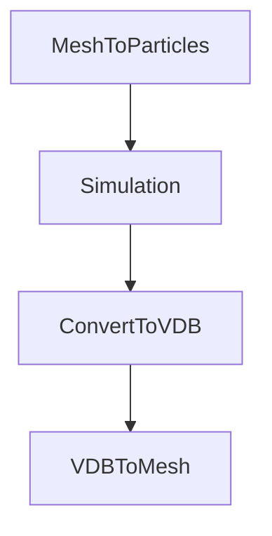

# How to Install ParticleFluids Add-On

2022/03/31 

# Install
First of all, please visit this Microsoft's web page and download Visual Studio2019 runtime(x64).

[VisualC++runtime](https://docs.microsoft.com/ja-jp/cpp/windows/latest-supported-vc-redist?view=msvc-170
 "VisualC++runtime")

 

# Configuration

This add-on consists of solver and OpenVDB tools.

Simulation itself can be done without OpenVDB.

However, using our OpenVDB tool, you can do whole process including pre, post processing.

## Flow of Simulation

