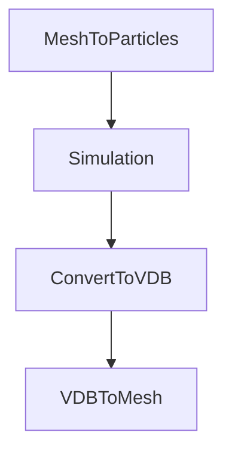

# How to Install ParticleFluids Add-On

2022/03/31 

## インストール
Microsoft社のWebサイトからVisualStudio2019ランタイム(x64)をインストールします．

[VisualC++runtime](https://docs.microsoft.com/ja-jp/cpp/windows/latest-supported-vc-redist?view=msvc-170
 "VisualC++runtime")

下にあるX64を選択します．
 

## 構成

本アドオンはソルバー本体と，OpenVDBツールから構成されています．
シミュレーション自体はOpenVDBを用いることなく実行できますが，
プリ、ポストまでBlender上で完結させることができます．

## シミュレーションの流れ
下図に示すように，MeshからParticleを生成し，それに物理属性を付与し，シミュレーションを行います．シミュレーションを行ったあとはOpenVDBボリューム経由でメッシュを生成することができます．

