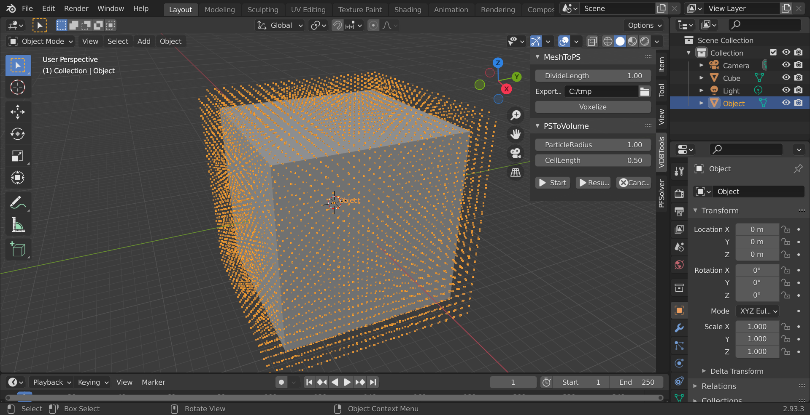
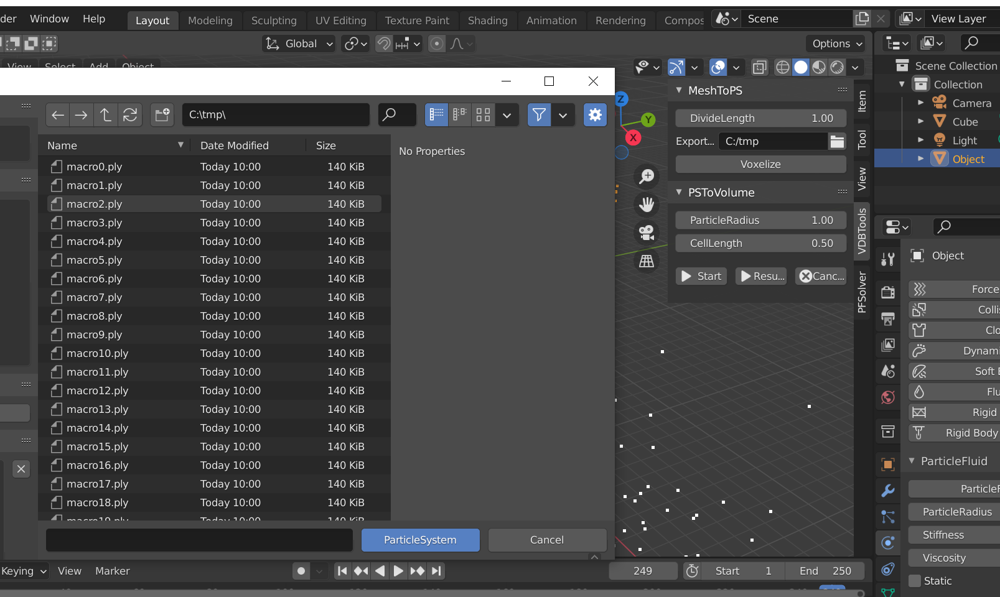
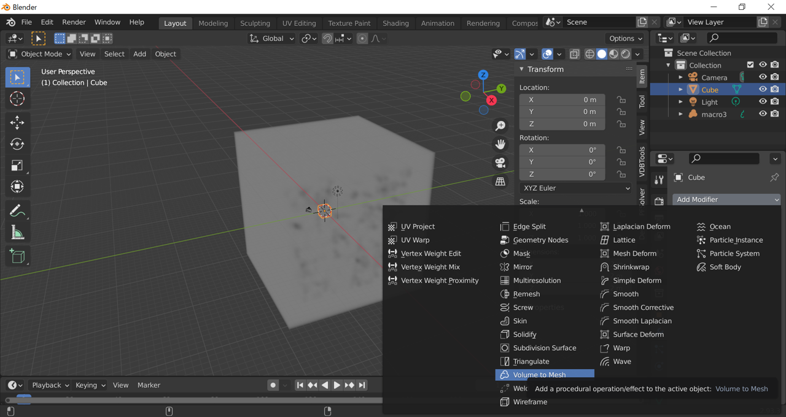

# Tutorial1 Hello Fluids!

2022/03/31 

## Creating Fluid

- Select [Cube] in Blender's default mesh,
- Select [Object Properties]，and set values [ScaleX],[ScaleY],[ScaleZ]to[10,10,10]．

 

- Keep selecting [Cube]，push [VDBTools]->[MeshToPS]->[Voxelize]．
- Converted points can be shown in [Object], which has no faces, can be appeared．

 

To simulate fluids, you have to add parameters to the particles.

- Select [Object]，and open [Physics Properties] tab．
- Push [PFFluid] button．
- You can set parameters．
- In this case, use default value.
 

### Start Simulation

 - Open [PFSolver] tab．
 - Set export directory on [ExportPath].
 - Press [Start] button, then simulation starts!
 - If you check [Render] checkbox, you can check particle's movements.

 

### Convert to VDB volume

- [PFTools]->[ToVDB], a dialog will be appeared.
- Select .ply files generated above.(On Blender, you can select all files with Ctrl+A)
 
- Then push [Convert] button, starts converts, and .vdb files are generated in the same directory.

### Meshing
Blender supports OpenVDB requential file import.
 
 

