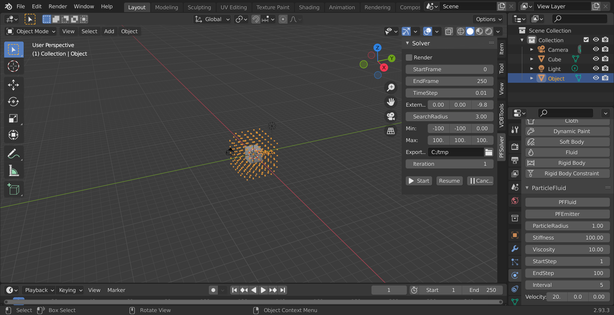
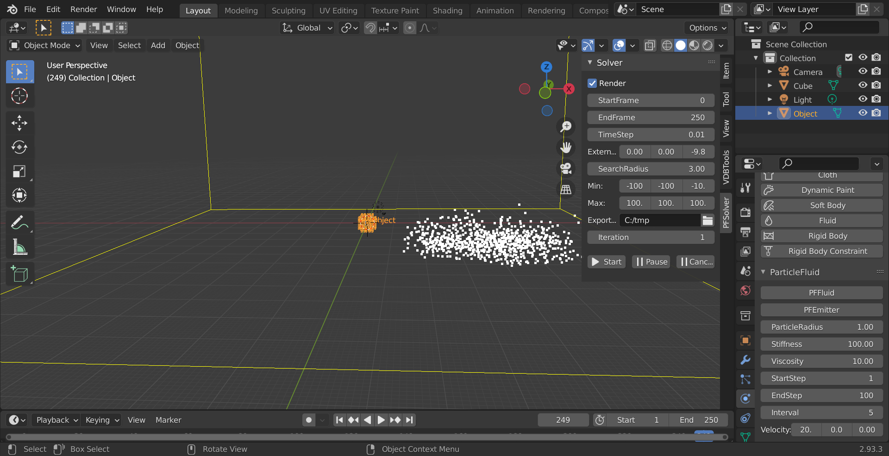

# ParticleFluids Tutorial2 Hello Emitter!

2022/03/31 

## Fluidの作成

- Blenderデフォルトで生成されている[Cube]を選択し
- [Object Properties]から，[Scale]をそれぞれ[1,1,1]とします．
- [Cube]を選択したまま，[VDBTools]->[MeshToPS]->[Voxelize]を押します．
- するとツリー上に[Object]という頂点だけのパーティクルオブジェクトが現れます．
- 作成した[Object]を選択し，[Physics Properties]タブを開きます．
- [PFEmitter]ボタンを押します．
- パラメータ設定用タブが開きます．
- [Velocity]を[20,0,0]に設定します．

 

## シミュレーションの開始
- [PFSolver]タブを開きます．
- [Min]を[-100,-100,-25]とします．

 

以下のステップはチュートリアル1と同じです．

## VDBボリュームへの変換

## Meshing

## レンダリング

