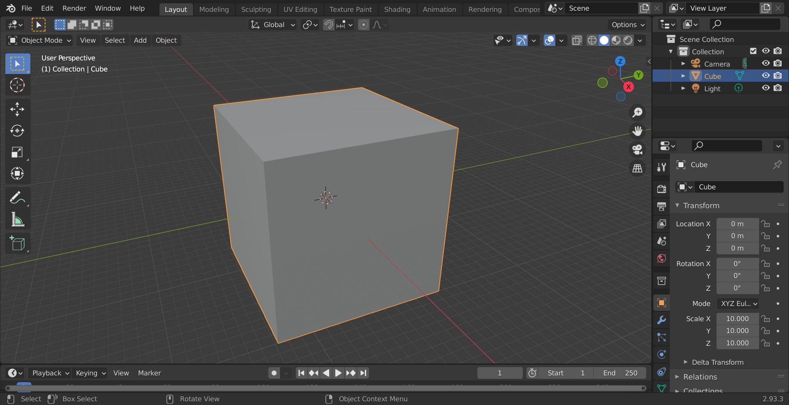
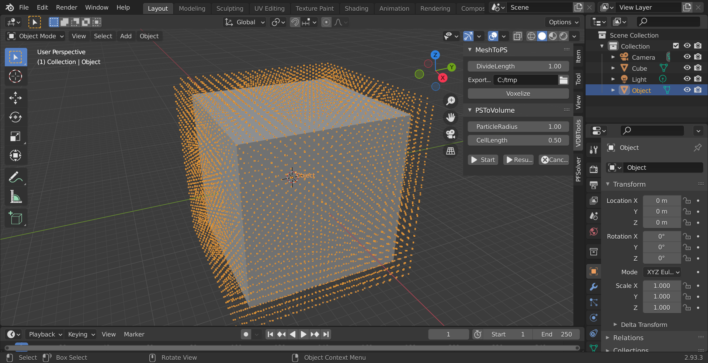
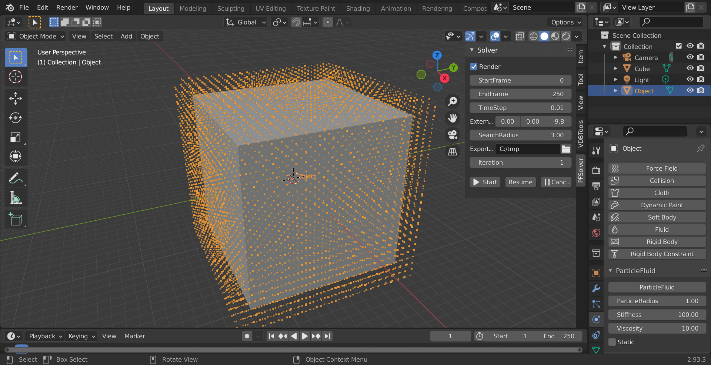
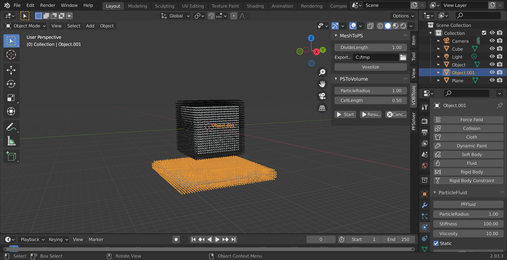
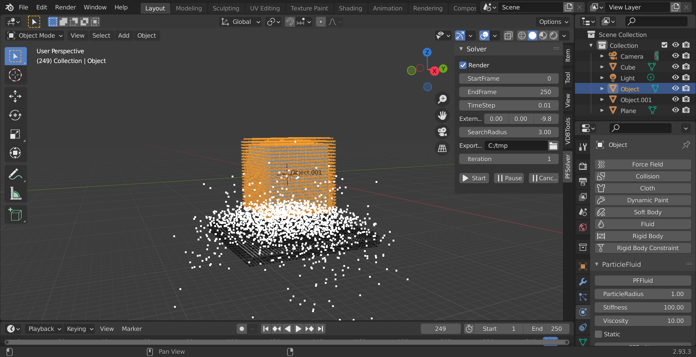
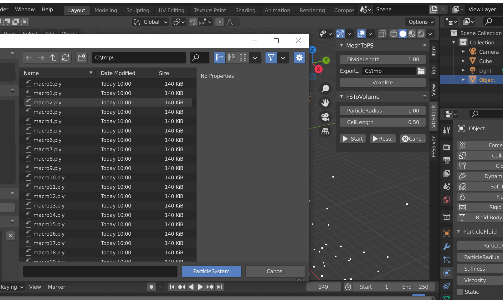
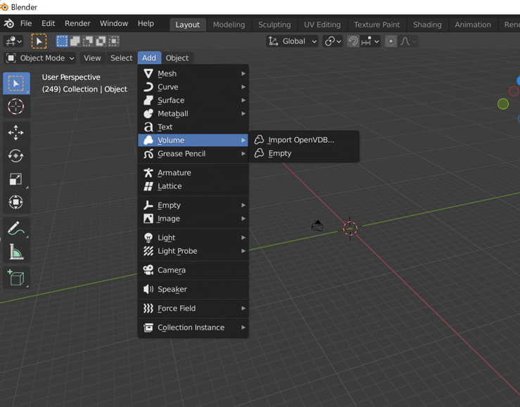
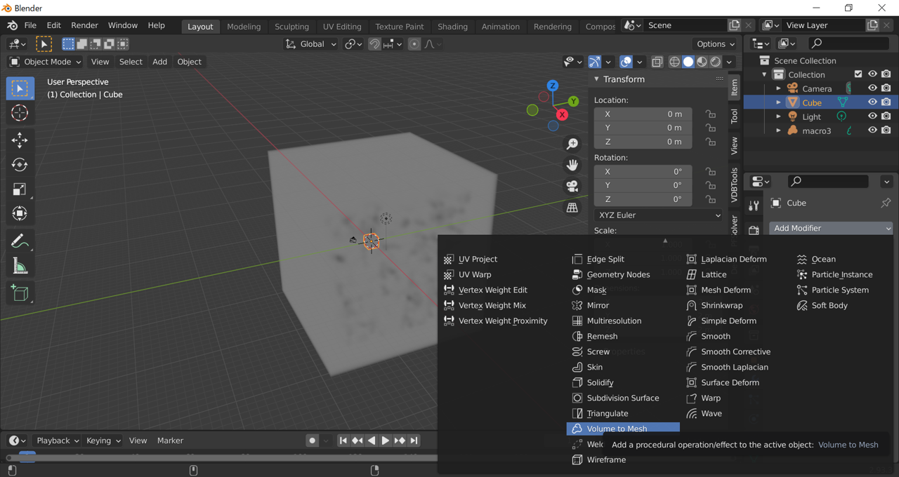

# ParticleFluids Tutorial2 Hello Emitter!

2022/03/31 

## Fluidの作成

- Blenderデフォルトで生成されている[Cube]を選択し
- [Object Properties]から，[Scale]をそれぞれ[10,10,10]とします．

 

- [Cube]を選択したまま，[VDBTools]->[MeshToPS]->[Voxelize]を押します．
- するとツリー上に[Object]という頂点だけのパーティクルオブジェクトが現れます．

 

- 作成した[Object]を選択し，[Physics Properties]タブを開きます．
- [PFEmitter]ボタンを押します．
- パラメータ設定用タブが開きます．
- ここではそのままデフォルト値を用います．

 

### Boundaryの設定

- [Add]->[Mesh]->[Plane]で床にする平面を新たに作成します．
 

- [Object Properties]から[Scale]を[20,20,1]とします．
Locationを[0,0,-20]とします．

- 同様にして[Voxelize]を実行してParticlesに変換します．
 

- [Object001]を選択し，[Physics Properties]->[PFFluid]ボタンを押します．
- パラメータ設定用タブが開きます．
- **ここで[Static]チェックボックスをマークしてください**

### シミュレーションの開始

 - [PFSolver]タブを開きます．
 - [ExportPath]で出力されるシミュレーションデータのディレクトリを設定します．
 - [Start]ボタンでシミュレーションが開始されます．
 - [Render]チェックボックスにチェックをつけておくと，シミュレーション途中のParticleの動きを確認できます．
 

### VDBボリュームへの変換

 - [PFSolver]->[Start]を押すとダイアログが表示されます．
 - 先ほど出力したplyファイルを選択します．(BlenderではCtrl+Aで全選択できます)
 - [Convert]ボタンを押すとコンバート処理が始まり，同じフォルダにVDB形式のデータが作成されます．
 

### Meshing
Blender標準の機能で連番のOpenVDBファイルを入力として扱うことができます．
 
 

### レンダリング
あとは通常のMeshと同じです．
Blenderのマテリアル設定を行えばレンダリングできます．
