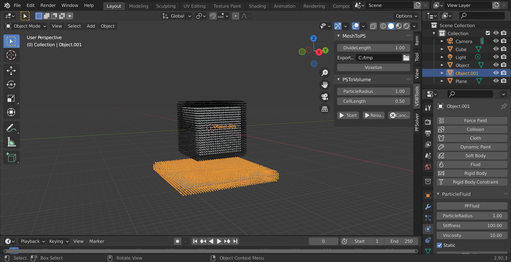

# ParticleFluids Tutorial 3 Hello, Obstacles!

2022/03/31 

On this add-on, obstacles can be created as same as fluids.

## Creating Fluid
Create fluids same as Tutorial1.

## Creating Obstacle

- Create a mesh by [Add]->[Mesh]->[Plane]．
 

- Open [Object Properties] tab, and change [Scale] to [20,20,1], and Location to [0,0,-20]．

- [VDBTools]->[MeshToPS]->[Voxelize]
 

- Select[Object001]，push [Physics Properties]->[PFFluid] button．
- **Mark [Static]Check box**

## シミュレーションの開始
 - Open [PFSolver] tab．
 - Change [Min] to [-100,100,-100]．

Following steps are same as Tutorial1.

## Start Simulation

## Convert to VDB volume

## Meshing