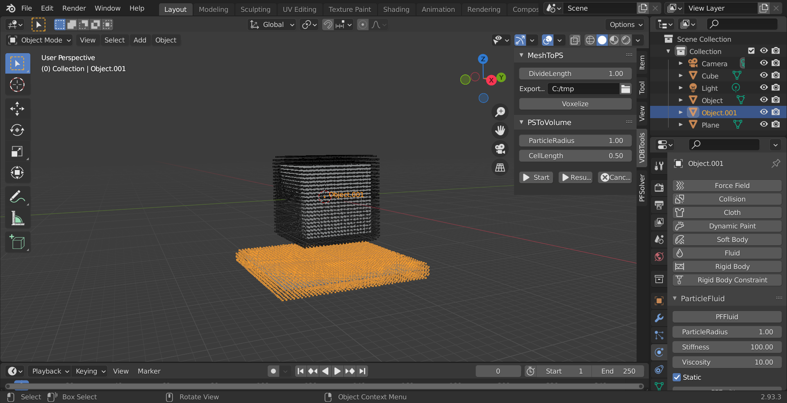
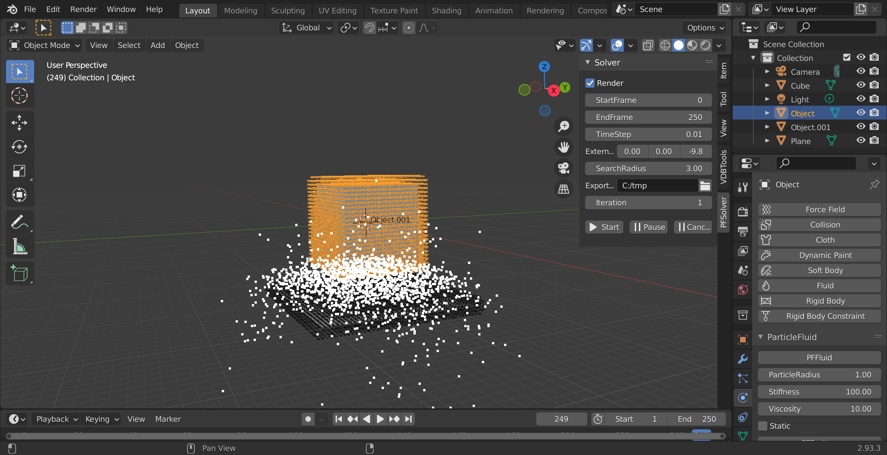

# ParticleFluids Tutorial 3 Hello, Obstacles!

2022/03/31 

本アドオンでは，障害物の設定もFluidと同様に行うことができます．

## Fluidの作成
チュートリアル1と同じ手順でFluidを作成します．

### Obstacleの設定

- [Add]->[Mesh]->[Plane]で床にする平面を新たに作成します．
 

- [Object Properties]から[Scale]を[20,20,1]とします．
Locationを[0,0,-20]とします．

- 同様にして[Voxelize]を実行してParticlesに変換します．
 

- [Object001]を選択し，[Physics Properties]->[PFFluid]ボタンを押します．
- パラメータ設定用タブが開きます．
- **ここで[Static]チェックボックスをマークしてください**

### シミュレーションの開始
チュートリアル1と同じ手順でシミュレーションをおこないます．
 
