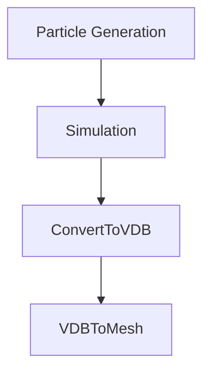

# ParticleFluids Tutorial

2022 premiumgraphics

# Install
First of all, please visit the URL and download Visual Studio2019 runtime(x64).

# Configuration
This add-on consists of solver and OpenVDB tools.

## Flow of Simulation

## Tutorial1

Fluid simulation can be done without OpenVDB tools.
But using OpenVDB tools, you can do the whole process including pre-processing and post-processing.

## Creating particles

Using our OpenVDB tool, you can create particles from meshes.

 

Using our OpenVDB tool, you can create particles from meshes.

### Making Fluids
 

To simulate fluids, you have to add parameters to the particles.

### Start Simulation
 

### Convert to VDB volume
 

### Convert VDB volume to Mesh
 
Using Blender's standard functions, you can make mesh from VDB volume.