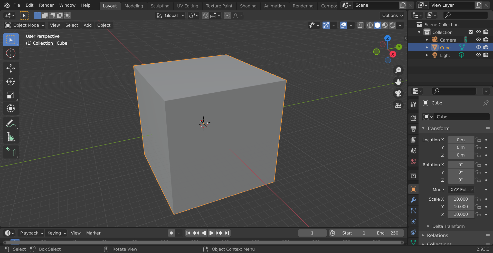

# ParticleFluids Tutorial

2022 premiumgraphics

# Install
First of all, please visit the URL and download Visual Studio2019 runtime(x64).
[VisualC++runtime](https://docs.microsoft.com/ja-jp/cpp/windows/latest-supported-vc-redist?view=msvc-170
 "VisualC++runtime")

# Configuration
This add-on consists of solver and OpenVDB tools.

Simulation itself can be done without OpenVDB.

However, using our OpenVDB tool, you can do whole process including pre, post processing.

## Flow of Simulation

## Tutorial1 Hello Fluids!

## Creating particles

- Select [Cube] in Blender's default mesh,
- Select [Object Properties]，and set values [ScaleX],[ScaleY],[ScaleZ]to10,10,10．

 

- Keep selecting [Cube]，push [VDBTools]->[MeshToPS]->[Voxelize]．
- Converted points can be shown in [Object], which has no faces, can be appeared．

 

### Set Fluid Attributes to Particles

To simulate fluids, you have to add parameters to the particles.

- Select [Object]，and open [Physics Properties] tab．
- Push [PFFluid] button．
- You can set parameters．
- In this case, use default value.
 

### Start Simulation

 - Open [PFSolver] tab．
 - Set export directory on [ExportPath].
 - Press [Start] button, then simulation starts!
 - If you check [Render] checkbox, you can check particle's movements.

 

### Convert to VDB volume
 

### Convert VDB volume to Mesh
 
Using Blender's standard functions, you can make mesh from VDB volume.