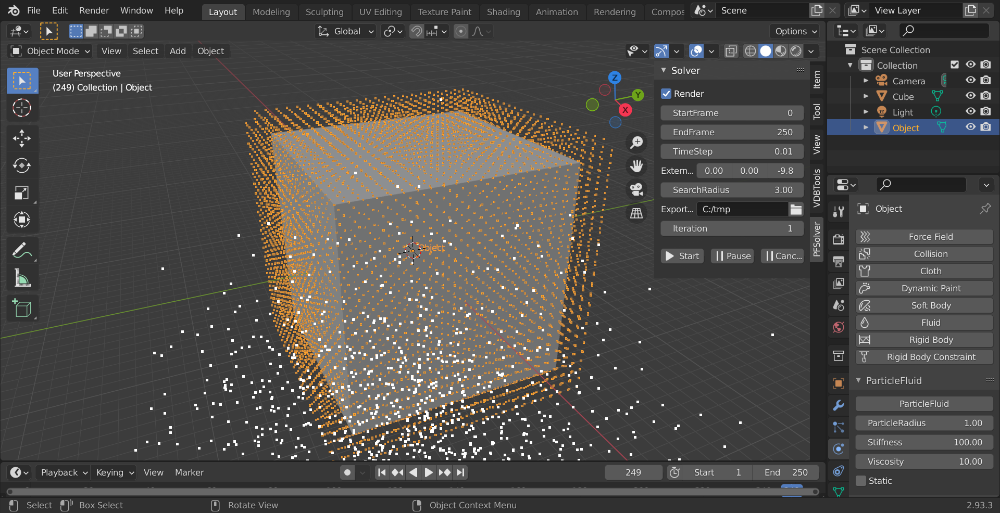

# ParticleFluids Tutorial

2022 premiumgraphics

# Install
First of all, please visit the URL and download Visual Studio2019 runtime(x64).
[VisualC++runtime](https://docs.microsoft.com/ja-jp/cpp/windows/latest-supported-vc-redist?view=msvc-170
 "VisualC++runtime")

# Configuration

In this add-on, simulation can be done with Particles, without meshes, grids etc.

But to adapt Blender, we support OpenVDB.

Of course, you can use another software for converting points.

This add-on consists of solver and OpenVDB tools.

Simulation itself can be done without OpenVDB.

However, using our OpenVDB tool, you can do whole process including pre, post processing.

## Flow of Simulation

## Tutorial1 Hello Fluids!

## Creating particles

- Select [Cube] in Blender's default mesh,
- Select [Object Properties]，and set values [ScaleX],[ScaleY],[ScaleZ]to10,10,10．

 

- Keep selecting [Cube]，push [VDBTools]->[MeshToPS]->[Voxelize]．
- Converted points can be shown in [Object], which has no faces, can be appeared．

 

### Set Fluid Attributes to Particles

To simulate fluids, you have to add parameters to the particles.

- Select [Object]，and open [Physics Properties] tab．
- Push [PFFluid] button．
- You can set parameters．
- In this case, use default value.
 

### Start Simulation

 - Open [PFSolver] tab．
 - Set export directory on [ExportPath].
 - Press [Start] button, then simulation starts!
 - If you check [Render] checkbox, you can check particle's movements.

 

### Check Result

 - There are sequential .ply files in the directory you set to[ExportPath].
 - You can check particle position with Blender's default import function.

### Adding Obstacle
At this time, there are no obstacles, so the particles just drop.
In practice, obstacle(floor) is must.
On this add-on, you can set obstacle same as fluids.

- Make a plane with [Add]->[Mesh]->[Plane]．
 

- Select[Object Properties] tab, and chenge [Scale]to[20,20,1].
This is a floor, so [Location] should be changed to [0, 0,-20].

- This plane must convert to points with same as above.[VDBTools]->[MeshToPS]->[Voxelize].
 

- **Please check [Static] chekck box**

### Start Simulation(Again)
- Open [PFSolver] tab，then push [Start] button to start simjulation.
- In this case, particles are reflected on the floor.
 

### Convert to VDB volume

- [PFTools]->[ToVDB], a dialog will be appeared.
- Select .ply files generated above.(On Blender, you can select all files with Ctrl+A)
 
- Then push [Convert] button, starts converts, and .vdb files are generated in the same directory.

### Meshing
Blender supports OpenVDB requential file import.
 

### レンダリング

### 
 

### Convert VDB volume to Mesh
 
Using Blender's standard functions, you can make mesh from VDB volume.