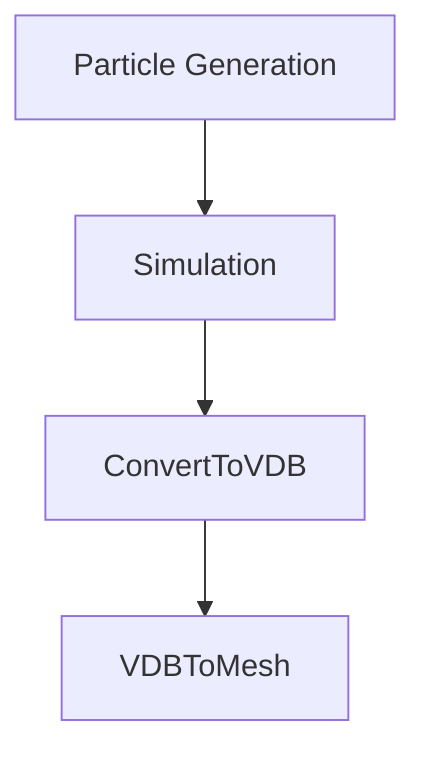
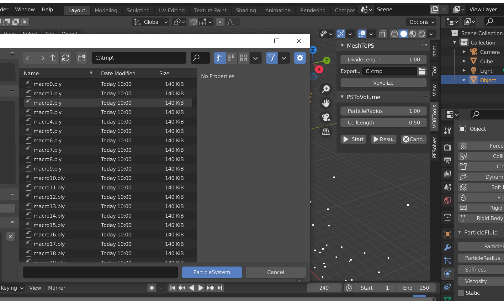

# ParticleFluids Tutorial

2022 premiumgraphics

## インストール
Microsoft社のHPからVisualStudio2019ランタイム(x64)をインストールします．

[VisualC++runtime](https://docs.microsoft.com/ja-jp/cpp/windows/latest-supported-vc-redist?view=msvc-170
 "VisualC++runtime")

下にあるX64を選択します．

## 構成
本アドオンはソルバー本体と，OpenVDBツールから構成されています．
シミュレーション自体はOpenVDBを用いることなく実行できますが，
プリ、ポストまでBlender上で完結させることができます．

## シミュレーションの流れ

## チュートリアル Hello, Fluids!

### Particle Systemデータの作成

- Blenderデフォルトの[Cube]の[ScaleX],[ScaleY],[ScaleZ]をそれぞれ10,10,10とします．

 

- [Cube]を選択したまま，[Voxelizer]->[MeshToPS]を選択し，[Convert]を押します．
- するとツリー上に[ParticleSystem01]というオブジェクトが現れます．

 

### Fluidデータの作成

- 先ほど作成した[ParticleSystem01]を選択し，[Physics]タブを開きます．
- [ParticleFluids]ボタンを押します．
- パラメータ設定用タブが開きます．

 

### シミュレーションの開始
[PFSolver]タブでSolverを追加します．
[Start]ボタンでシミュレーションが開始されます．
[ExportPath]で出力されるシミュレーションデータのディレクトリを設定します．
plyファイルが連番で出力されてます．
 

### 障害物の作成
この時点では障害物（床）がないため，粒子が落ちていくだけです．
現実的には障害物を設定しておく必要があります．

本アドオンでは，障害物の設定もFluidと同様に行うことができます．
[Static]チェックボックスをマークするだけです．

### 再びシミュレーションの開始

### VDBボリュームへの変換
[PFSolver]->[Start]を押すとダイアログが表示されます．
ここで先ほど出力したplyファイルを選択します．
(BlenderではCtrl+Aで全選択できます)
 
[Convert]ボタンを押すとコンバート処理が始まり，同じフォルダにVDB形式のデータが作成されます．

### Meshing
Blender標準の機能で連番のOpenVDBファイルを入力として扱うことができます．
 

## それから
自由にParticleSystemを追加したり削除したりして自分のCGを作ってみてください．