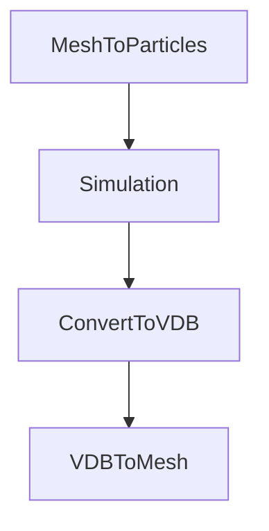

# ParticleFluids Tutorial

2022/03/31 

Premiumgraphics Inc.

## インストール
Microsoft社のWebサイトからVisualStudio2019ランタイム(x64)をインストールします．

[VisualC++runtime](https://docs.microsoft.com/ja-jp/cpp/windows/latest-supported-vc-redist?view=msvc-170
 "VisualC++runtime")

下にあるX64を選択します．
 

## 構成

本アドオンはソルバー本体と，OpenVDBツールから構成されています．
シミュレーション自体はOpenVDBを用いることなく実行できますが，
プリ、ポストまでBlender上で完結させることができます．

## シミュレーションの流れ
下図に示すように，MeshからParticleを生成し，それに物理属性を付与し，シミュレーションを行います．シミュレーションを行ったあとはOpenVDBボリューム経由でメッシュを生成することができます．

## チュートリアル Hello, Fluids!

## Fluidの作成

- Blenderデフォルトで生成されている[Cube]を選択し
- [Object Properties]から，[Scale]をそれぞれ[10,10,10]とします．

 

- [Cube]を選択したまま，[VDBTools]->[MeshToPS]->[Voxelize]を押します．
- するとツリー上に[Object]という頂点だけのパーティクルオブジェクトが現れます．

 

- 作成した[Object]を選択し，[Physics Properties]タブを開きます．
- [PFFluid]ボタンを押します．
- パラメータ設定用タブが開きます．
- ここではそのままデフォルト値を用います．

 

### Boundaryの設定

この時点では障害物（床）がないため，粒子が落ちていくだけです．
現実的には障害物を設定しておく必要があります．
本アドオンでは，障害物の設定もFluidと同様に行うことができます．

- [Add]->[Mesh]->[Plane]で床にする平面を新たに作成します．
 

- [Object Properties]から[Scale]を[20,20,1]とします．
Locationを[0,0,-20]とします．

- 同様にして[Voxelize]を実行してParticlesに変換します．
 

- [Object001]を選択し，[Physics Properties]->[PFFluid]ボタンを押します．
- パラメータ設定用タブが開きます．
- **ここで[Static]チェックボックスをマークしてください**

### シミュレーションの開始

 - [PFSolver]タブを開きます．
 - [ExportPath]で出力されるシミュレーションデータのディレクトリを設定します．
 - [Start]ボタンでシミュレーションが開始されます．
 - [Render]チェックボックスにチェックをつけておくと，シミュレーション途中のParticleの動きを確認できます．
 

### 結果の確認

 - [ExportPath]で設定したフォルダにplyファイルが連番で出力されているので，それを確認します．
 - Blenderでimportすると，落下していく様子が確認できます．

### VDBボリュームへの変換
[PFSolver]->[Start]を押すとダイアログが表示されます．
ここで先ほど出力したplyファイルを選択します．
(BlenderではCtrl+Aで全選択できます)
 
[Convert]ボタンを押すとコンバート処理が始まり，同じフォルダにVDB形式のデータが作成されます．

### Meshing
Blender標準の機能で連番のOpenVDBファイルを入力として扱うことができます．
 

### レンダリング
あとは通常のMeshと同じです．
Blenderのマテリアル設定を行えばレンダリングできます．
